# Tablet Bar Mount

## Zadání

Vaším úkolem je namodelovat držák na tablet na řídítka motocyklu, za účelem použítí tabletu k navigaci.
Držák tabletu je potřeba namontovat na představce řídítek, protože to je nejbezpečnější a zároveň nejpevnějsí misto, které je jezdci snadno na očích.

### Představce


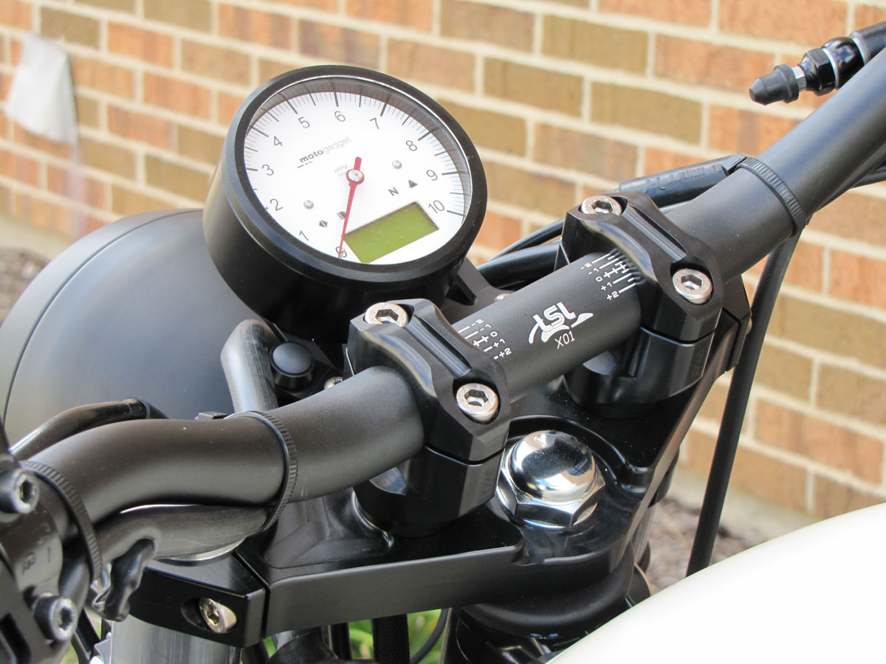

## Interface modelu

```
module tabletBarMount() {}

module top_part( tablet_width,
				    tablet_height,
				    tablet_thickness,
				    rounded_corner, 
				    overlay,
				    screw_diameter,
				    cable_cutout_height,
				    cable_cutout_thickness) {}

module bottom_part() {}

```

### Top Part

Top part, bez zaoblenych rohu

```
top_part( 
			tablet_width = ,
			tablet_height = ,
			tablet_thickness = ,
			rounded_corner = , 
			overlay = ,
			screw_diameter = ,
			cable_cutout_height = ,
			cable_cutout_thickness = 
		 )
				    
```
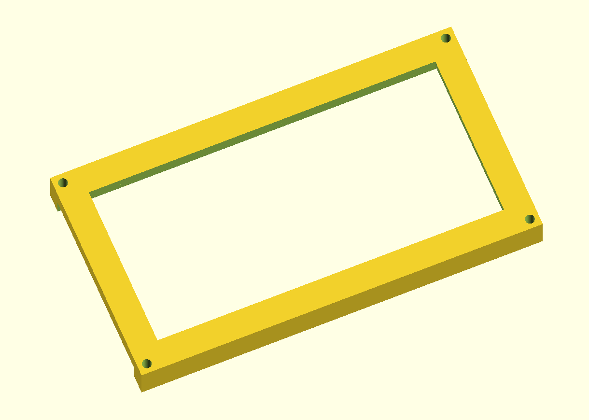
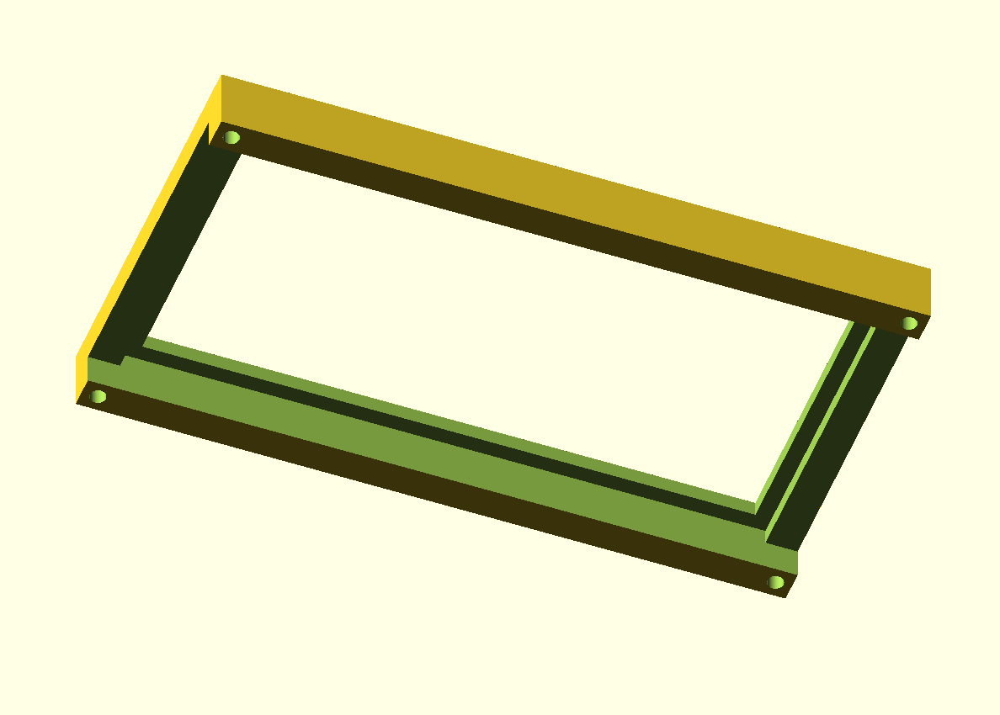
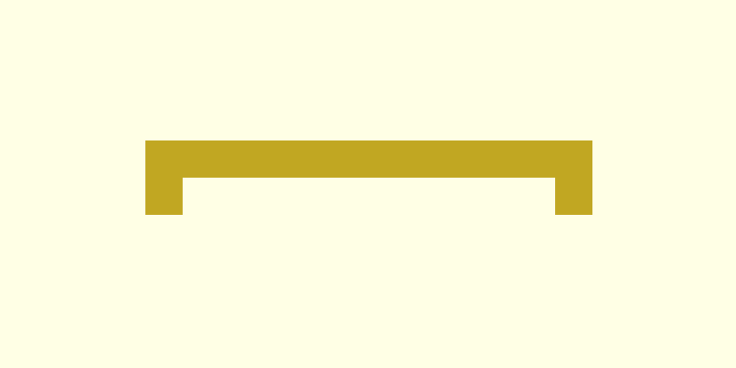


Top part, se zaoblenymi rohy // TODO

### Bottom part

#### Objímka představce řídítek

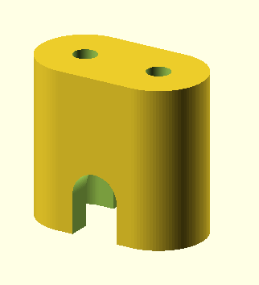
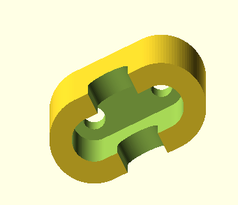
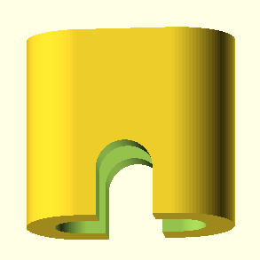

#### Kombinace objímek řídítek
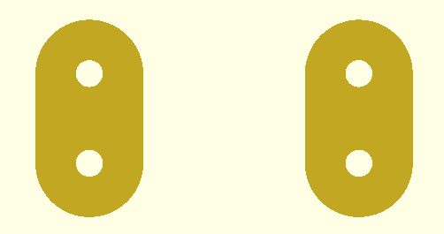

#### Spodní část držáku tabletu
  - Díry ve spodním držáku tabletu, nejsou skrz a slouží k vložení matiček, čili jsou pětihranné
 

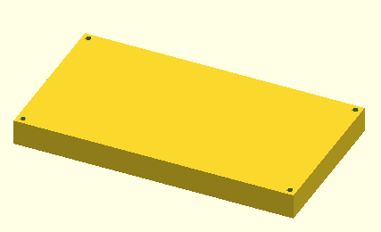
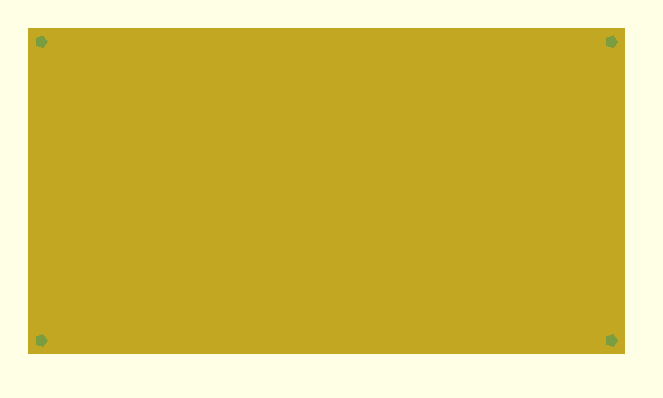

#### Kombinace horního a spodního držáku tabletu
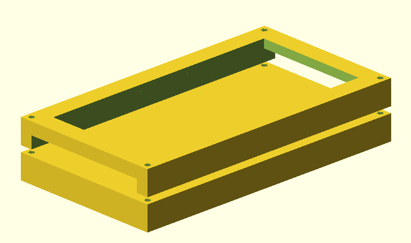

#### Kombinace objímky a spodního držáku tabletu
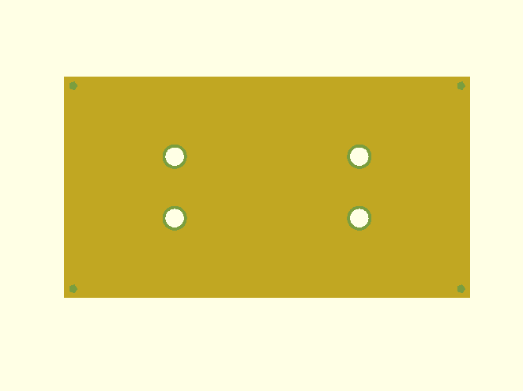
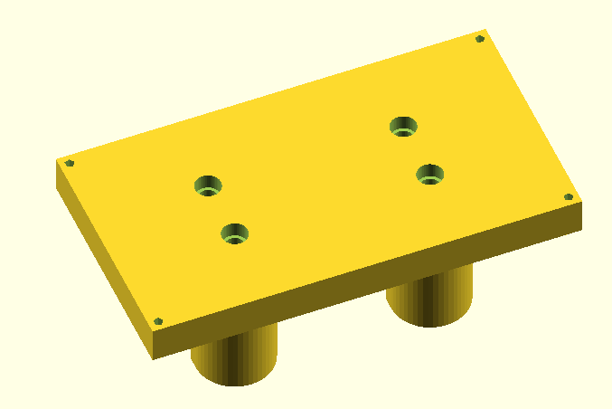
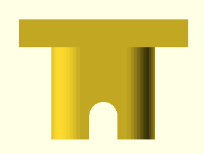

#### Celý držák

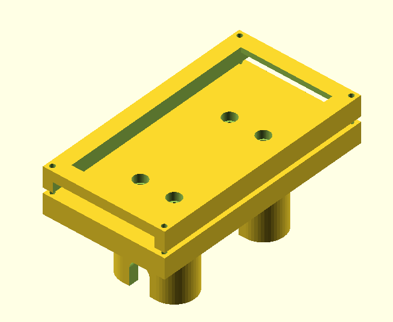
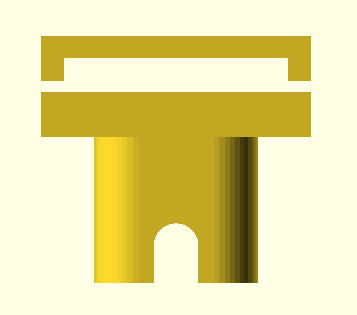

#### Možnost nastevení pozorovacího úhlu
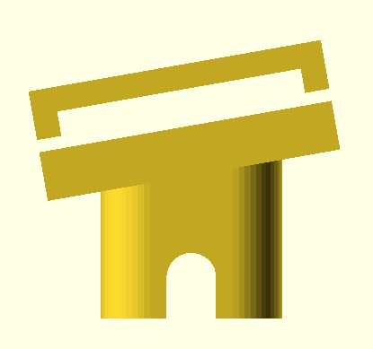
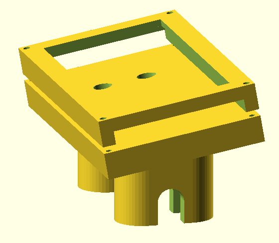


