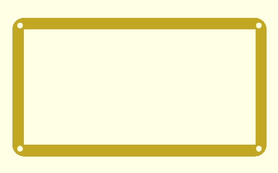
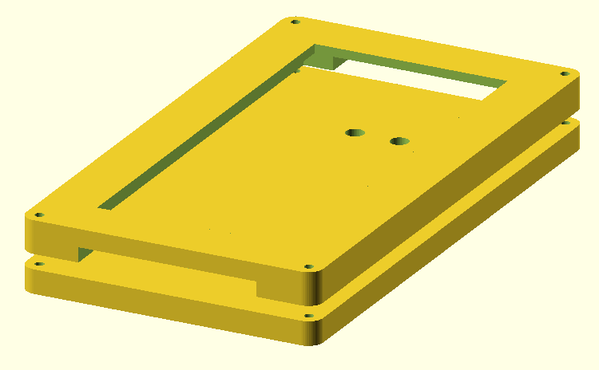
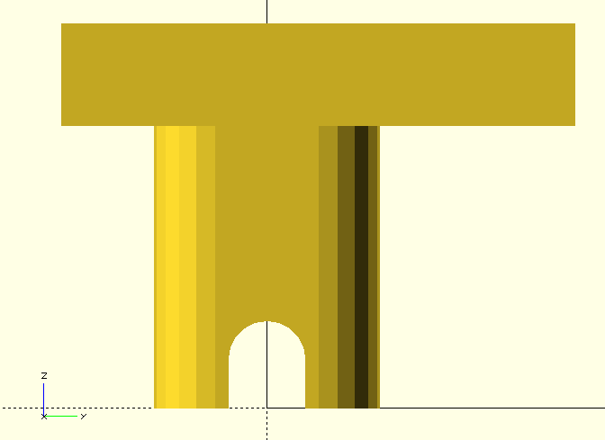

# Tablet Bar Mount (ALPHA VERZE)
**Toto je alpha verze domacího úkolu, změny vyhrazeny**

**Pokud máte jakékoliv dotazy, či naleznete chyby napište je prosím do Issues k tomuto repozitáři**

## Motivace

Nic podobného neexistuje, i přes poptávku motorkářu, čili po splnění úkolu ho můžete OpenSourcovat a publikovat například na Thingiverse nebo podobných webech a býti slavní... :)

## Zadání

Vaším úkolem je namodelovat držák na tablet na řídítka motocyklu, za účelem použítí tabletu k navigaci.
Držák tabletu je potřeba namontovat na představce řídítek, protože to je nejbezpečnější a zároveň nejpevnějsí misto, které je jezdci snadno na očích.

## Model

Vámi namodelovaný model se bude skládat ze dvou objektů.

  - Horní část modelu s výřezem pro display tabletu
  - Spodní část modelu, který se dá přídělat na přestavce řídítek
  - Je nezbytné aby vámi naprogramovaný model byl správně umístěn do souřadnic
    - Spodní část objímek musí ležet na `z = 0`
    - Střed rozteče objímek musí ležet na `x = 0` a `y = 0`
    - Řídítka motocyklu jsou rovnoběžné s osou x
    - Jezdec se na tablet dívá ze záporného směru po ose y (tedy dívá se kladným směrem)
    - Samostatně použitý `top_part` leží na podložce (`z = 0`), vystředěn podle os x a y
        - displayem vzhůru, dírami na kabely po směru osy Y
    - **Pokud toto nebude Váš model splňovat, tak neprojdete ani jedním testem**

## Nefunkční požadavky

  - Na vytvoření děr pro spojení horní a spodní části držáku musíte pouřít for cyklus
  - S hodnotou `$fn` můžete pracovat pouze v případě vytvoření šestihranných děr pro matky viz zadání

## Interface modelu

```
module tablet_bar_mount(holder_width,
                        holder_height,
                        holder_thickness,
                        holder_overlay_thickness,
                        holder_position_x,
                        holder_position_y,
                        holder_position_angle,
                        tablet_width,	
                        tablet_height,
                        tablet_depth,
                        tablet_screen_width,
                        tablet_screen_height,
                        rounded_corner_radius, 
                        connecting_screw_diameter,
                        cable_cutout_height,
                        cable_cutout_depth,
                        nut_diameter,
                        nut_offset,
                        nut_depth,
                        screw_diameter,
                        screw_head_diameter,
                        screw_head_depth,
                        screw_spacing,
                        raisers_spacing,
                        raiser_width,
                        raiser_height,
                        raiser_depth,
                        raiser_inlet_wall_thickness,
                        raiser_inlet_top_thickness,
                        bar_diameter,
                        bar_location,
                        parts_offset) {}
```

Tento interface se dělí na na interface dalších dvou modulů `top_part(...)` a `bottom_part(...)`

V případě zavolání `tablet_bar_mount` se vykreslí obě části napozicované dle dalších pravidel a obrázků.
Mezera mezi nimi je `parts_offset` (měřeno kolmo ke styčným plochám).

## Horní část

### Interface

```
module top_part(holder_width,
                holder_height,
                holder_overlay_thickness,
                tablet_width,
                tablet_height,
                tablet_depth,
                tablet_screen_width,
                tablet_screen_height,
                rounded_corner_radius, 
                connecting_screw_diameter,
                connecting_screw_offset,
                cable_cutout_height,
                cable_cutout_depth) {}
```

### Argumenty
  - `holder_width, holder_height` jsou rozměry držáku, tloušťka horní části se odvíjí od `tablet_depth` a `holder_overlay_thickness`
  - `holder_overlay_thickness` je tlouštka modelu mezi displayem a horní částí držáku, čili ta část, která překrývá okraje tabletu, kde není display
  - `tablet_width, tablet_height, tablet_depth` jsou rozměry tabletu
  - `tablet_screen_width, tablet_screen_height` jsou rozměry displaye tabletu, čili otvor, ktery bude vyříznut do horní části držáku.
  - `rounded_corner_radius` poloměr vnějšího zakřivení rohů, pokud je argument nulový tak rohy nejsou zaoblené
  - `connecting_screw_diameter` průměr šroubu, které jsou drží horní a spodní část držáku
  - `connecting_screw_offset` pozice šroubu výše, definována nákresem, u modulu `tablet_bar_mount` přejímá hodnotu `nut_offset`
  - `cable_cutout_height` výška vyřezu pro kabely
  - `cable_cutout_depth` tloušťka výřezu pro kabely

## Spodní část

### Interface

```
 module bottom_part(holder_width,
                    holder_height,
                    holder_thickness,
                    rounded_corner_radius,
                    nut_diameter,
                    nut_offset,
                    nut_depth,
                    screw_diameter,
                    screw_head_diameter,
                    screw_head_depth,
                    screw_spacing,
                    raiser_width,
                    raiser_height,
                    raiser_depth,
                    raiser_inlet_wall_thickness,
                    raiser_inlet_top_thickness,
                    bar_diameter,
                    bar_location,
                    raisers_spacing,
                    holder_position_x,
                    holder_position_y,
                    holder_position_angle) {}
```

### Argumenty

  - `holder_width, holder_height` jsou rozměry držáku
  - `holder_thickness` je tloušťka spodní části držáku na kterém bude ležet tablet
  - `rounded_corner_radius` poloměr vnějšího zakřivení rohů, pokud je argument nulový tak rohy nejsou zaoblené
  - `nut_diameter` průměr šestihranné matky (průměr kružnice opsané)
  - `nut_offset` pozice matky (více info na obrázku)
  - `nut_depth` tloušťka matky, která bude zasazena do spodní části držáku
  - `screw_diameter` průměř šroubu, který se pasuje do představce řídítek
  - `screw_head_diameter` průměr hlavičky šroubu, který pasuje do představce řídítek
  - `screw_head_depth` výška hlavičky šroubu, který bude zapuštěn do spodní části modelu
  - `screw_spacing` je rozteč po ose Y, po směru X jsou vždy uprostřed objímky
  - `raiser_width` je šířka reálného představce řídítek
  - `raiser_height` je délka realného představce řídítek 
  - `raiser_depth` je výška reálného představce řídítek
  - `raiser_inlet_wall_thickness` je tloušťka objímky představce řídítek
  - `raiser_inlet_top_thickness` je tloušťka horní části objímky představce
  - `bar_diameter` průměr řídítek
  - `bar_location` je délka změřena od spodní části představce k vrchní bodu řídítek
  - `raisers_spacing` je rozteč středu šroubu představců, nezáleží zda horních či spodních, vzdálenosti horních a spodních šroubů jsou vždy stejné
  - `holder_position_x` pozice držáku po ose x, pro kladné hodnoty bude držák posunut po kladném směru (doprava v defaultním OpenSCAD renderu), pro záporné opačným směrem
  - `holder_position_y` pozice držáku po ose y, pro kladné hodnoty bude držák posunut po kladném směru (doprava v defaultním OpenSSCAD renderu), pro záporné opačným směrem
  - `holder_position_angle` je úhel držáku ve stupních na objímkách představců, mezní testované hodnoty jsou `-45` a `45`, pro kladný úhel bude držák natočen směrem k jezdci na motocyklu, tedy zápornému směru osy y (defaultní OpenSCAD render vypadá tak, že pokud tento argument bude kladný, tak se držák bude rotovat tak, aby bylo na display lépe vidět).

Výška objímky představce je měřena ve středu představce a je kombinací argumentů `raiser_depth` a `raiser_inlet_top_thickness`

Můžete předpokládat, že `raiser_width < raiser_height` a `screw_head_depth < holder_thickness`.

Nejprve aplikujte `holder_position_{x,y}` a potom `holder_position_angle` podle červeného bodu v obrázku níže.

## Představce


## Horní část držáku




## Spodní část držáku tabletu


## Kombinace horního a spodního držáku tabletu



## Objímka představce řídítek


## Kombinace objímek řídítek


## Kombinace objímky a spodního držáku tabletu


## Celý držák


## Pozice matic / spojovacích šroubů

Je dána hodnotou `connecting_screw_offset` respektive `nut_offset`, dle červené čáry na obrázku:


Jde o vzdálenost osy šroubu od (někdy pomyslného) rohu obdélníku tvořícího podstavu držáku.

Otočení díry na matici je irelevantní (nezajímá nás).

## Možnost nastevení pozorovacího úhlu


## Pozice držáku vůči objímkám představců

### Posun po ose Y


### Posun po ose X


