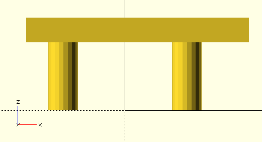

# Tablet Bar Mount (ALPHA VERZE)
**Toto je alpha verze domacího úkolu, změny vyhrazeny**

**Pokud máte jakékoliv dotazy, či naleznete chyby napište je prosím do Issues k tomuto repozitáři**

## Motivace

Nic podobného neexistuje, i přes poptávku motorkářu, čili po splnění úkolu ho můžete OpenSourcovat a publikovat například na Thingiverse nebo podobných webech a býti slavní... :)

## Zadání

Vaším úkolem je namodelovat držák na tablet na řídítka motocyklu, za účelem použítí tabletu k navigaci.
Držák tabletu je potřeba namontovat na představce řídítek, protože to je nejbezpečnější a zároveň nejpevnějsí misto, které je jezdci snadno na očích.

## Model

Vámi namodelovaný model se bude skládat ze dvou objektů.

  - Horní část modelu s výřezem pro display modelu
  - Spodní část modelu, který se dá přídělat na přestavce řídítek

## Nefunkční požadavky

  - Na vytvoření děr pro spojení horní a spodní části držáku musíte pouřít for cyklus
  - S konstantou `$fn` můžete pracovat pouze v případě vytvoření šestihranných děr pro matky viz zadání

## Interface modelu

```
module tablet_bar_mount(holder_width,
                        holder_height,
                        holder_thickness,
                        holder_overlay_thickness,
                        holder_position_x,
                        holder_position_y,
                        tablet_width,	
                        tablet_height,
                        tablet_depth,
                        tablet_screen_width,
                        tablet_screen_height,
                        rounded_corner_radius, 
                        connecting_screw_diameter,
                        cable_cutout_height,
                        cable_cutout_depth,
                        nut_diameter,
                        nut_depth,
                        screw_diameter,
                        screw_head_diameter,
                        screw_head_depth,
                        raiser_width,
                        raiser_height,
                        raiser_depth,
                        raiser_inlet_wall_thickness,
                        raiser_inlet_top_thickness,
                        bar_diameter,
                        bar_location,
                        raisers_spacing) {}
```

## Horní část

### Interface

```
module top_part(holder_width,
                holder_height,
                holder_overlay_thickness,
                holder_position_x,
                holder_position_y,
                tablet_width,	
                tablet_height,
                tablet_depth,
                tablet_screen_width,
                tablet_screen_height,
                rounded_corner_radius, 
                connecting_screw_diameter,
                cable_cutout_height,
                cable_cutout_depth) {}
```

### Argumenty
  - `holder_width, holder_height` jsou rozměry držáku, tloušťka horní části se odvíjí od `tablet_depth` a `holder_overlay_thickness`
  - `holder_overlay_thickness` je tlouštka modelu mezi displayem a horní částí držáku, čili ta část, která překrývá okraje tabletu, kde není display
  - `tablet_width, tablet_height, tablet_depth` jsou rozměry tabletu
  - `tablet_screen_width, tablet_screen_height` jsou rozměry displaye tabletu, čili otvor, ktery bude vyříznut do horní části držáku.
  - `rounded_corner_radius` poloměr zakřivení rohů, pokud je argument nulový tak rohy nejsou zaoblené
  - `connecting_screw_diameter` průměr šroubu, které jsou drží horní a spodní část držáku
  - `cable_cutout_height` výška vyřezu pro kabely
  - `cable_cutout_depth` tloušťka výřezu pro kabely
  - `holder_position_x` pozice držáku po ose x
  - `holder_position_y` pozice držáku po ose y

## Spodní část

### Interface

```
 module bottom_part(holder_width,
                    holder_height,
                    holder_thickness,
                    nut_diameter,
                    nut_depth,
                    screw_diameter,
                    screw_head_diameter,
                    screw_head_depth,
                    raiser_width,
                    raiser_height,
                    raiser_depth,
                    raiser_inlet_wall_thickness,
                    raiser_inlet_top_thickness,
                    bar_diameter,
                    bar_location,
                    raisers_spacing,
                    holder_position_x
                    holder_position_y) {}
```

### Argumenty

  - `holder_width, holder_height` jsou rozměry držáku
  - `holder_thickness` je tloušťka spodní části držáku ne kterém bude ležet tablet
  - `nut_diameter` průměr šestihranné matky
  - `nut_depth` tloušťka matky, která bude zasazena do spodní části držáku
  - `screw_diameter` průměř šroubu, který se pasuje do představce řídítek
  - `screw_head_diameter` průměr hlavičky šroubu, který pasuje do představce řídítek
  - `screw_head_depth` výška hlavičky šroubu, který bude zapuštěn do spodní části modelu
  - `raiser_width` je šířka reálného představce řídítek
  - `raiser_height` je délka realného představce řídítek 
  - `raiser_depth` je výška reálného představce řídítek
  - `raiser_inlet_wall_thickness` je tloušťka objímky představce řídítek
  - `raiser_inlet_top_thickness` je tloušťka horní části objímky představce
  - `bar_diameter` průměr řídítek
  - `bar_location` je délka změřena od spodní části představce k vrchní bodu řídítek
  - `raisers_spacing` je rozteč středu šroubu představců, nezáleží zda horních či spodních, vzdálenosti horních a spodních šroubů jsou vždy stejné
  - `holder_position_x` pozice držáku po ose x
  - `holder_position_y` pozice držáku po ose y

## Představce


## Horní část držáku


## Spodní část držáku tabletu


## Kombinace horního a spodního držáku tabletu


## Objímka představce řídítek


## Kombinace objímek řídítek


## Kombinace objímky a spodního držáku tabletu


## Celý držák


## Možnost nastevení pozorovacího úhlu


## Pozice držáku vůči objímkám představců

### Posun po ose Y


### Posun po ose X



